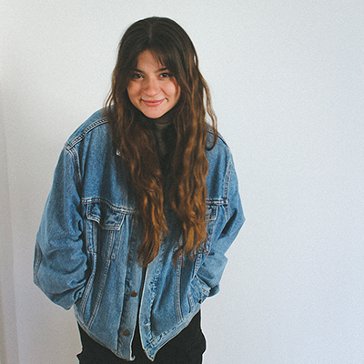

# First impression

## Draft presentation

- [About me]
- [Projects]

## About me

Hi,

my name’s Diana, I’m a graphic designer based in Prague & Rome. My whole family is from Ukraine, but lives in Rome. I can speak Czech, English, Russian, Ukrainian & I study Italian.

I currently work for two advertising companies named Saatchi & Saatchi and Prinity, I love teamwork and I’m a big fan of deadlines. I mean, I can make it till deadline if it’s neccessary. I also freelance occasionally, working only with myself is a pleasure too. I studied bussiness academy before an art university, so starting my journey was quite random. I have always had that feeling that I have to create. I can play the guitar, draw and I just love to express myself in artistic ways.

I’d say that I’m openminded, friendly, empathic and easy to talk to. In my free time I enjoy spending my time and going for a walks with my puppy, friends & just being outside. I’m interested in psychology and art therapy.  It will not be surprise if I say that I'm falling for art, currently I’m working on my Bachelor thesis about Art brut, that’s my most favorite type of art at the moment. I also create and I have one art brut fun piece of mine. I’m also falling for architecture and photography, mainly analogue.

I enjoy my work mostly when I can be creative in some experimental ways. I love dynamic designs and pieces that just make you feel like something is happening.

I love to design typography that is curvy, dynamic and organic.

I enjoy to work with mixed media ways of designing.

I also do brand & visual identities that have a concept and a strategy behind their logo. When I work with client I see it as a teamwork and collaboration. I really love to search for our solutions, understand their point of views and express them in their most authentic way. I mainly design personal brands, because I can work with very interesting people and creators.

## My projects
