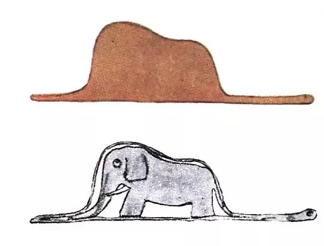

# Creativity

by Diana Bylen

25th of May 2024

See the [slides](img/creativity.pdf)

## Introduction

Hi guys,

my name is Diana & I study graphic design.

Sometimes when I get a new project I struggle a lot. That's why I wanted to share my journey & what I've learned while struggling.

## What is creativity?
“Creativity is the process of using imagination and original thinking to produce something new or innovative.“

Okay, but it's only according to Chat GPT. Let's have a humans POV.

I think it has all started when we were children and we wanted to express ourselves. People are creative beings since they're born, in my opinion.
It is not genetic. You can learn to be creative. You are creative. You just have obstacles.

Since we are adults we have life experience that changed us. We don't have the childish directness anymore. We more likely control ourselves and we listen to other peoples opinion.

But guess what? PAST CAN'T DEFINE US ANYMORE.

## Little prince
One day I was just laying in my bed and overthinking, cause that's what I usually do when I go to sleep. I had a vision. I remembered about the book that I've read when I was on a primary school. More precisely I've remembered a drawing of the Little prince.

It is so iconic. When you think of it like... Nothing has stopped him from sticking to his own idea. Despite the fact that the pilot told him that it's a hat, he was claiming that it is a snake that ate an elephant.

We were like this when we were kids also. We've drawn something and we were so happy about it. It was pure happiness that came out of us. Because we didn't have those strict parameters that we have now as adults.

We've had competition around us and a lot of times we didn't even give a shot to a new hobby, because we've already felt that we are not good enough. We need to get rid of these complexes.

Okay, I'm talking to creatives in this class. So you've already had this journey. Maybe you struggle sometimes (as I do), maybe you don't and you're a lucky person. But I think you understand me and you know what these feelings are like.

Let's agree on that...

## Creativity is freedom
We live in a world full of buildings, technology and other cool stuff. We already do take these for granted.

When we create it makes us happy. 

When we create without any complexes? That makes us free.

Let's promise to ourselves that we are going to be kind to other creatives.

Let's promise to ourselves that we are going to be openminded and trying to understand other point of views.

Let's promise to outselves that we are going to believe that what we give comes back to us.

I don't have any secret tea on how to become more creative.
But at least I can share what helps me.
You already know that kindness and openmindness are my 2 biggest pillars.

Now what?

## Not a 100% instructions on how to be creative from a student that has almost burned out while doing her thesis
I'd recommend you to interlace your time with pleasant moments. It requires a good time schedule tho. I think you know yourself the best, so I'm not going to tell you how to set your time productively as I don't know how much time you need for your specific projects.

After you set your time you just add some extra to it.

## My process
1. Idea (Catching ideas while riding the tram, taking a shower or before the sleep time)
2. A beer with friends or a run (depends on your preferences)
3. Moodboard & sketch
4. A beer with friends or a run (depends on your preferences)
5. First drafts
6. A beer with friends or a run (depends on your preferences)

Oh lord, the tea is = not going crazy about it, giving yourself a break to let it breathe, have a proper time management.

Now I see.

And lastly... One tip for you buddy.
## Get inspired outside!
