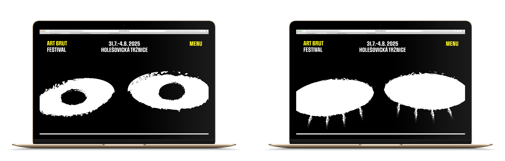
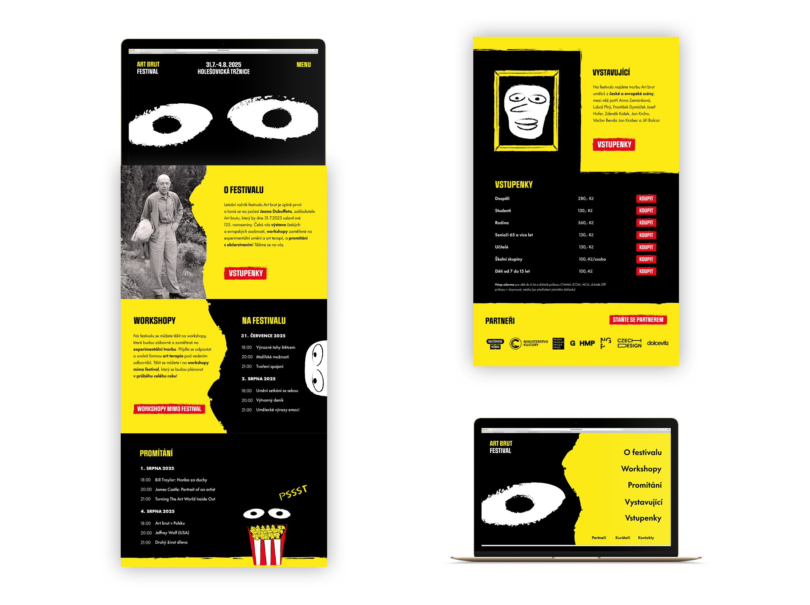

# Art brut: The inner child
## Visual identity of a festival

by Diana Bylen

19th of April 2024

See the [slides](img/artbrutfest.pdf)

## Abstract
The bachelor thesis deals with creating a visual identity for a fictional festival focused on Art brut. The aim of the work was to create an unified visual style that effectively communicates the unique style and character of this specific art form.

The theoretical part focuses on basic information about Art brut, its history, including the contribution of Jean Dubuffet, and Art brut in the Czech Republic. It also explores marketing strategies, brand personality, social networks and festivals.

The practical part focuses on the concrete steps of creating a visual identity for a festival. It starts with identifying the target group and creating a moodboard for inspiration. It then focuses on the actual design of the visual identity, including the logo, colour scheme, fonts and other graphic elements. It also includes an application of this visual identity to the communication mediums such as posters, billboards, social media, websites and other promotional materials.

Keywords: Art brut, visual identity, festival, outsider art, primitive art, visual communication, graphic design

## Introduction
Hi guys,

my name is Diana Bylen & I'm a graphic design student.

I've always been interested in psychology and arts. I've learned about Art brut thanks to our Arts history subject. I found it very interesting and I've decided to get to know it more. After I've done some research, I've decided to choose it as my Bachelor thesis topic.

## Process
I wanted to create something that would benefit our culture and Art brut in Czech republic & I chose to create a festival because of the variety of program. My Art brut festival contains exhibition, projections and art therapeutic workshops. Conceptually it is in honor of Jean Dubuffets 125th birthday.

### Who is Jean Dubuffet?
Jean Dubuffet was a French artist known for his innovative approach to art, particularly in the realm of Outsider art, which he termed "Art Brut." He was interested in arts of people from psychiatric hospitals & children art work.

## The key visuals
I was inspired by the Jean Dubuffets doodles. Based on those I've created two mascots that are shouting the festivals name. I love the idea of Jean Dubuffet, that he was originally inspired by children. Children are without past experience and they create authentically. Childrens artwork is primitive and sincere. That's where his main idea has came from.

The main visuals contain two outdoor posters. I wanted to express emotions & madness of Art brut. That's why I've chosen two mascots that shout at each other. The main idea was to shock ambient people, catch attention & be memorable. I enjoyed creating this stuff, because I felt free. I felt rebelliously and like everything is possible, because it's Art brut.

## Copywriting & socials
After I've creating the outdoor campaign, I've moved to socials. I wanted to keep it simple, but funky. Starting with the website... I've wanted to add some cute and simple animation, that just catches the eye. That's why I've put blinking eyes on the landing page. Then you can find there important information and buy tickets.

The main motto of the festival is "Wake up your inner child". It's because of the art therapeutic workshops that people can join. This motto is used on social media a lot. I was thinking that if the festival was successful, it could organize workshops anytime. Art brut festival could also hold competitions for people. The main media for this kind of propagation is Instagram.

I've also created a printed version of the program. I've used funky elements and mascots. I personally love the cover. I found it funny and unique while creating it. We can find some basic information about art brut in it & artists that are going to be on the exhibition. I've also included exhibition & projection program on the other page.

Lastly I've created some event materials, like bracelettes and staff cards for example. And promotional items. Such as tote bags, t-shirts, stickers, badges. All of those had the same visuals. Here are some stickers for example.

## Conclusion
It was a long and though journey, but I'm glad of the results. I hope that one day I'll have the opportunity to implement this kind of festival, because I think it would be a strong benefit to our cultural events.
